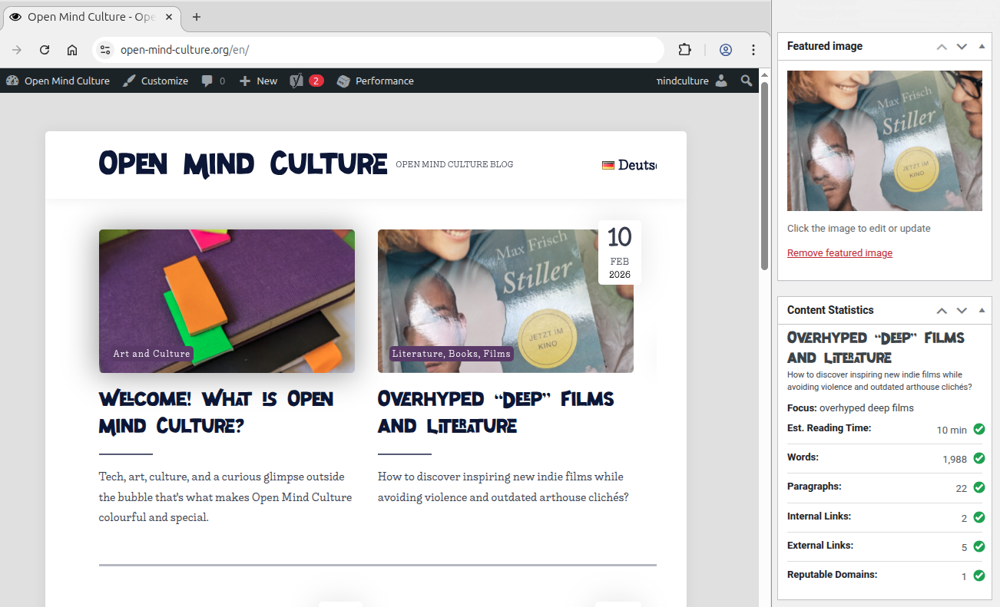
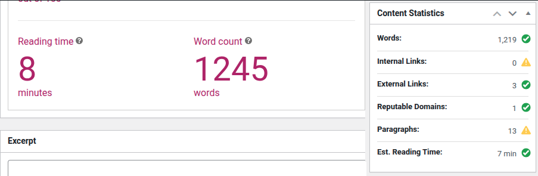

# wp-content-stats-meta-box

A simple WordPress plugin showing stats while using classic or block editor.
Currently, as of plugin release 1.2.0, only the classic version is tested.
If you are interested in the block editor version I am looking forward to your pull requests!

## Installation and Usage 

Install the plugin to see stats while writing a post. Stats will update automatically debounced from time to time. See the [screenshots section](#screenshots) below for a visual preview of the plugin's functionality. If the plugin is not available in the official WordPress plugin directory yet, you can obtain a zip file from the [GitHub release page](https://github.com/openmindculture/wp-content-stats-meta-box/releases) and upload it manually by clicking add plugin -> upload plugin -> choose file -> install now -> activate.

### Troubleshooting

**Updating**

If an update installation fails, deactivate and delete all instances of this plugin before installing the latest version again.

## Disclaimer and Known Limitations

This plugin is provided as is without any warranty.

Initial releases have not yet been optimized for efficient performance. They only work in the classic editor and the provided stats may slightly differ from those of similar plugins like Yoast, as you can see in the [screenshots section](#screenshots. Goals and heuristic signals for reputable outgoing links (like linking to [wikipedia.org](https://en.wikipedia.org/)) are hard-coded based on common recommendations for writing general-purpose blog posts. The plugin version 1.2.0 has been tested successfully with WordPress 6.9 on [Open-Mind-Culture.org](https://www.open-mind-culture.org/) in 2026.

Feel free to review the open [issues on GitHub](https://github.com/openmindculture/wp-content-stats-meta-box/issues) and contribute to the project. 

## Development

- `docker compose up --build`

- open http://localhost:8666/wp-admin

- default admin credentials: `admin`:`secret`

- activate the plugin

## Deployment

Zip `plugins/content-stats-meta-box` to crate a plugin archive file that can be uploaded on the add a plugin page in WordPress' admin backoffice. 

## Screenshots

The screenshot below shows published blog teasers in an archive overview layout on the left and the content statistics meta box providing a similar preview of the post title and excerpt acting like a partial preview of the published teaser layout. 

This plugin can coexist and complement other content creation assistance tools like Yoast WP SEO, even though their number might slightly differ. See the following screenshot for example.

This screenshot shows an early plugin version on the right and slightly different statistics for the same post content provided by Yoast's WordPress SEO insights: estimated reading time of 8 vs. 7 minutes, word count of 1245 vs. 1219 words.

Screenshots have been taken on [open-mind-culture.org](https://www.open-mind-culture.org/).

## Default Recommended Writing Metrics

- Ideal blog post title length: 50–60 characters (or roughly 6–10 words)
- Maximum excerpt length: ~110 characters (classic theme with Open Mind Culture fonts and layout)
- Focus keyphrase or keyword: 1-2 words, or 4-6 words for long-tail strategy

SEO plugins evaluate your content against the focus keyphrase and synonyms and related key phrases. Longer key phrases make it harder to optimize your post. Since you’ll need to repeatedly use a large number of words close to each other, it will be hard to keep your copy readable.

- Estimated Reading Time: 5-10 minutes
- Words: 1000-2000
- Paragraphs: at least 20
- Internal Links: 2-9, more internal than external links
- External Links: 2-5
- Reputable Domains: at least one external link to a reputable domain, e.g.
  - wikipedia.org
  - who.int
  - un.org
  - *.edu
  - etc.

### Weblinks: Untested Best Practices

Depending on your expertise and target group, reputable domains might include websites considered authoritative for a specific sector, like MDN or StackOverflow for tech, coding, and web development issues.

**Guest authors** usually place one outgoing link to one of their existing publications and another one to their profile or blog home page, either as part of the post content or as a link in their author's bio if the theme displays it on the post page. Guest authors should ideally link to at least one existing post within the same site or leave it to the site owner to add one or two such links later.

- Links in curated content should not use the `rel=nofollow` attribute.
- Outbound links should add `rel=noopener` and they might open in a new tab or window (`target=_blank`).
- Links to content in a different language should explicitly state the target language in a `hreflang=` attribute.

You can use additional internal and external tools to analyze and optimize your text, like obtaining a list or a visual word cloud of the most frequently used words, or a readability and style analysis or the statistical likelihood that your text has been written without the help of artificial intelligence (measured by perplexity metrics).